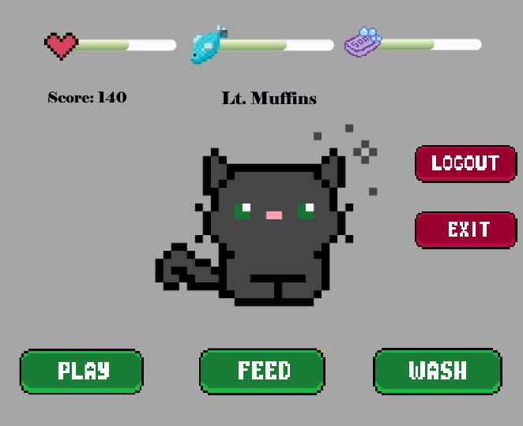
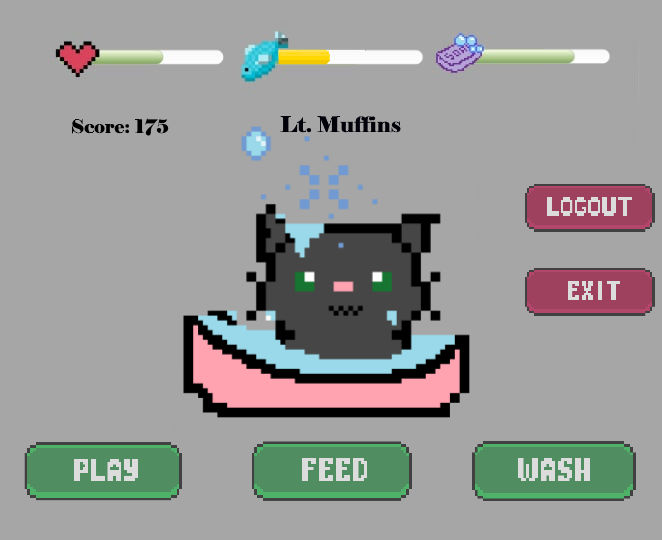

# VirtualPetSimulator

> Butnaru Alexandru\
> Maxim Casiana

*Advanced Java Programming*, Group 2B4 @ **FII UAIC 2024**

## Description
**VirtualPetSimulator** is a fun and interactive Java application that lets you adopt and take care of a virtual kitty. If neglected, your pet will become sad, dirty, and hungry. It's a charming, relaxing game for all ages, offering pixelated visuals, animations, and sounds.

---

## Features
- **User Login & Register**: 
  - Each player gets one custom-named pet upon sign-up.
  - Pet stats are saved when logging out and restored with adjustments based on the time spent offline - so come back to your little pet soon!
- **Persistent Data**:
  - Actions are saved and updated in the database in real-time, after each interaction with the pet.
  - Autosaver feature ensures data is saved every 5 minutes.
- **Visuals & Sounds**:
  - Pixelated textures and user interface.
  - Animations for actions, idle states, and more.
  - Sounds triggered by pet & player actions.
- **Interactive Gameplay**:
  - Feed, clean, and play with your pet to keep it happy and healthy.

---

## Screenshots

- Cat relaxing

---
- Cat taking a bath

---

## Technology Used
- **Java**: Core language for game logic.
- **Spring**: Framework for API development.
- **PostgreSQL**: Relational database to store user and pet data.
- **Hibernate**: For seamless database interaction.
- **JavaFX**: To create an engaging and user-friendly UI.

---

## Contributors
- **Casiana Maxim**:  
  - Game design, sprites, animations, sounds, UI design, bugfixing.
- **Alexandru Butnaru**:  
  - Game logic, API development, database management, game design, bugfixing.
